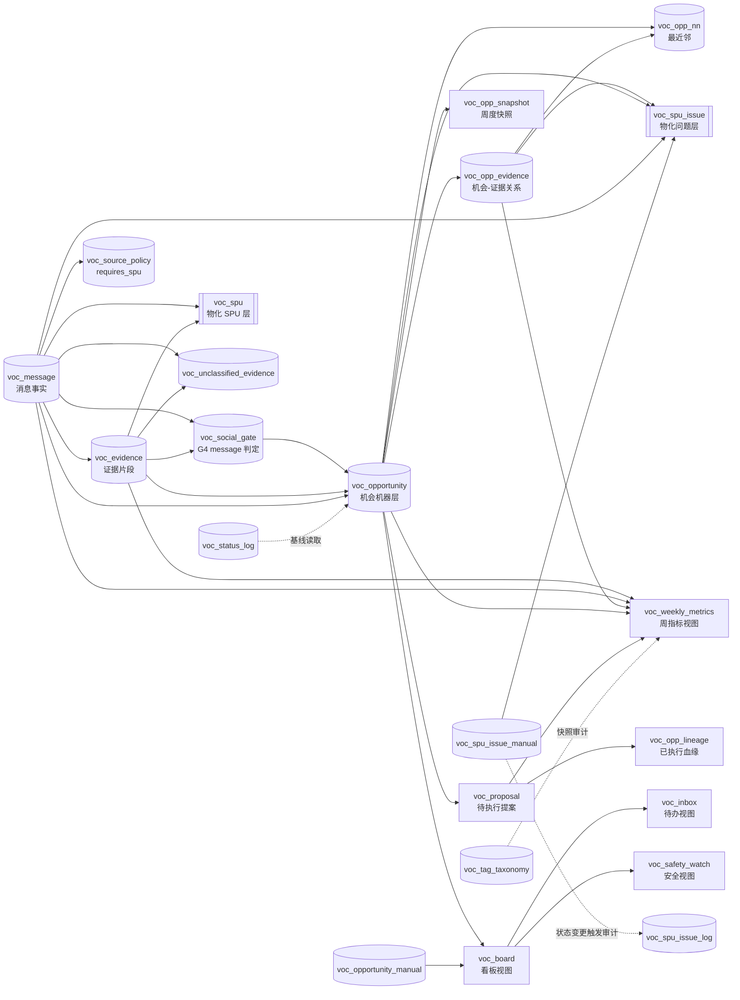

# VOC 全仓审计

审计日期：2026-08-19  
范围：仓库代码、`/tmp/voc_db_catalog.md`（2026-08-19 09:40 只读快照）  
边界：本审计未 SSH、未连接数据库、未执行 SQL、未调用 LLM/向量服务、未执行 git。除本文件外未修改任何文件。

> 目录快照是在一次全量重跑中途采集的。`voc_opp_snapshot`、`voc_opp_lineage`、`voc_proposal` 以及人工状态/日志表的 0 行，只能说明采集时尚未产生相应结果，不能单独证明路径已死亡。服务器 Dagster 清单中的 `geo-monitor`、`kol-dashboard`、`kol-feedback-automation` 属于其他项目；VOC 自己的单元文件已移入 `/home/sdy/voc-retired/`，不计为现行服务。

## A. 数据管道架构现状图

### A.1 当前真实链路

```mermaid
flowchart LR
  Y[云听 COMMENT/SOCIAL 导出\nyunting.export_window\ningest.py:68-73]
  I[窗口抽取与清洗\ningest_window\ningest.py:55-115]
  F[(事实层\nvoc_message + voc_evidence\ndb.py:130-134)]
  T[标签快照\nsnapshot_taxonomy\ningest.py:118-128]
  G123[G1-G3 结构门\n品牌/G2 标签/G3 官号\ndb.py:202-263,275-315]
  G4[G4 统一价值门\n按 message_id 缓存/投票\npipeline.py:139-179\nvalue_gate.py:148-210]
  G5[G5 2x2 路由\n诉求/缺陷 x SPU/无SPU\nrouting.py:88-107]
  PC[新品预聚类\n仅新品创新\npipeline.py:181-226\nprecluster.py:263-345]
  S1[Stage1 切分/最大团/账本\npipeline.py:298-316\nstage1.py:250-355]
  S24[Stage2 原型 -> Stage3 建议 -> Stage4 复核\ngenerate.py:50-180\nvalidate.py:217-230]
  P[(机会点持久化\nvoc_opportunity + voc_opp_evidence\npipeline.py:873-997)]
  R[L1/L2/L3 消解与跨来源补证\nresolve.py:22-171]
  U[统一收尾\n拆分提案/快照\nrun_generate.py:81-125]
  D[派生层刷新\nSPU/SPU-issue + n_eff\nexplode.py:7-16]
  N[最近邻缓存\nvoc_refresh_opp_nn\npipeline.py:662-684]
  L[放行到 PM\nbacklog/released_at\nlifecycle.py:17-44]
  V[(board/inbox/safety/weekly\n及 system 直接查询)]

  Y --> I --> F
  I --> T
  F --> G123 --> G4 --> G5
  G5 --> PC --> S1
  G5 --> S1
  S1 --> S24 --> R --> P
  P --> U --> D --> N --> L --> V
  P -. 证据关系/分类回算 .-> F
```

生产人工入口不是图中的 Dagster 调度，而是下面的 shell 顺序：

1. `pipeline/scripts/run_ingest.py:43-63` 按周调用 `ingest.ingest_window()`、快照 taxonomy、写 `voc_run_log`。
2. `pipeline/scripts/rerun_both.sh:274-285` 先运行阶段零 `warm_value_gate.py`，把 G4 结果预热到 `voc_social_gate`。
3. `pipeline/scripts/rerun_both.sh:287-299` 在单事务中清理 `voc_opp_evidence`、`voc_opp_snapshot`、`voc_proposal`、`voc_opp_lineage`、`voc_opportunity` 和 `voc_unclassified_evidence`，事实层保留。
4. `pipeline/scripts/rerun_both.sh:306-381` 并行启动 `run_generate.py --full-history --lifecycle existing/innovation --skip-finalize`；`pipeline.py:139-226` 内部完成 G1-G5、预聚类和路由。
5. `pipeline/scripts/rerun_both.sh:384-403` 再启动单独的 `run_generate.py --finalize-only`。其 `run_generate.py:81-96` 做跨来源合并，`:98-107` 做拆分提案，`:109-125` 写快照，`:126-139` 刷 SPU/最近邻，`:140-148` 放行 PM。

### A.2 五道门与生成细节

| 环节 | 代码事实 | 入口证据 |
|---|---|---|
| G1/G1b | `brands` 全为本品且同组根帖子/视频不能含第三方品牌 | `pipeline/voc_analytics/db.py:202-218,242-254` |
| G2 | 先排除 `SOCIAL_DROP_TAGS`，再要求至少一个 `SOCIAL_KEEP_TAGS` | `db.py:220-224,255-258` |
| G3 | 作者为空或不匹配官号正则才通过 | `db.py:226-231,259-263` |
| G4 | 社媒按消息去重；缓存命中则不重判，低置信/缺陷可三票多数；失败按消息记账 | `stages/value_gate.py:148-210`；调度入口 `pipeline.py:139-179` |
| G5 | `classify_evidence()` 按 R0-R3 使用 `spu ∪ spu_inherited` 和来源策略；社媒诉求/缺陷再路由到生命周期 | `classification.py:17-72`；`routing.py:88-107` |
| 预聚类 | 只对新品创新行执行，空 claim 直接异常 | `pipeline.py:181-226` |
| Stage1 | 分批投票、最大团分解、失败批次统计；高失败率阻断 | `stages/stage1.py:250-355` |
| Stage2-4 | 原型、建议、LLM 复核和程序化 grounding/格式校验 | `stages/generate.py:50-180`；`stages/validate.py:170-230,365-386` |
| 消解 | L1 使用 `(opp_type, core_tag)`，L2 向量 Top-k，L3 LLM；跨来源只在同生命周期内补证 | `resolve.py:22-36,50-107,110-171` |
| 持久化/回算 | 新建或挂载机会后写 `voc_opp_evidence`，同事务 recount 完整证据集 | `pipeline.py:873-997` |
| 派生/放行 | 全量刷新 `voc_spu`、`voc_spu_issue`、`n_eff`，刷新 NN 后再改 `backlog` | `explode.py:7-16`；`pipeline.py:662-684`；`lifecycle.py:17-44` |

全文上下文改造已经进入共享格式化函数：`stages/stage1.py:108-128` 负责片段加完整原文且按消息去重，`stages/generate.py:9-18,12-39` 复用该函数，Stage2 不再保留一份不带全文的旧副本。

### A.3 文档说的与代码做的不一致

| 文档说的 | 代码/实况 | 不一致与处置 |
|---|---|---|
| `pipeline/README.md:3,141,175`：Dagster 是生产/唯一调度，生产有三项 VOC systemd 服务 | `/tmp/voc_db_catalog.md` 的服务实况只有其他项目 Dagster；VOC 服务单元在 `/home/sdy/voc-retired/`。`pipeline/docs/运维交接.md:99-120` 已写“Dagster 退役、人工跑批” | 最高优先级更新 README、部署说明和首页运维入口，统一为手工链，或在重新部署后再恢复“唯一调度”表述 |
| `pipeline/README.md:126`、`system/README.md:5`：新品 ID/`channel` 仍是业务身份域 | `pipeline.py:22-42` 的 v3 身份只有 `opp_type/core_tag/problem_mode`；`resolve.py:23-35` L1 也无 channel；`024_drop_channel.sql:11` 删除列 | 文档过时；保留迁移历史，但运行/模型文档必须删除当前 channel 身份描述 |
| `pipeline/docs/data_architecture.html:235`、`pipeline/docs/pipeline_redesign.html:183,193,316`、`rework_plan.html:180`：新品 hash/L1 含 channel | 当前实现统一三元身份，生命周期分桶为 `(opp_type, topic)` | 更新为当前 v3 口径，并标注 024 已执行/已部署，不再写“未来删除” |
| `pipeline/docs/rework_plan.html:101-102,171-183`、`data_architecture.html:230`：017/2c 是“本轮不执行/未来代码” | 用户背景与现行代码已完成五道门、全量重跑和 024/片段全文改造；`pipeline.py`、`rerun_both.sh` 已是部署后链路 | 将 rework plan 归档为变更记录，另写当前状态页 |
| `pipeline/docs/pipeline_redesign.html:190,193,195`：2c“代码已落地·未运行”，且 L1 新品含 channel | 生产实况是手工链正在运行；L1 不含 channel；`definitions.py` 仍是 dormant 资产图 | 拆分“设计记录”和“现行运行手册”，避免把未运行历史当现状 |
| `pipeline/docs/运维交接.md:55-72,359-361`：迁移基线停在 015、多个关键工作“当前未执行” | 目录含 017、023-027，且背景明确两轮改造已部署；该文档本身 `:99-120` 又正确写 Dagster 退役 | 保留历史执行证据，但更新基线、执行状态和验收清单为生产事实；不能同时写“015 未执行”和“已于 2026-08-17 执行完毕” |
| `system/docs/voc_model_spec.html:99,114,458`：channel 仍是业务子类型且新品 hash 包含 channel | 代码、024、运行查询均已移除 channel | 更新规格版本，旧快照数字和 channel 字段标成历史 |

## B. 历史遗留代码清单

### B.1 channel 概念残留

| 文件:行号 | 判定理由 | 建议处置 |
|---|---|---|
| `pipeline/sql/001_schema.sql:85-90` | 初始 schema 建立 `voc_opportunity.channel`；是迁移历史，不能当现行 schema | 保留不可重放的历史迁移；在迁移索引中明确 024 后失效 |
| `pipeline/sql/003_views.sql:7-29`、`006_execute.sql:25-47`、`007_rebuild.sql:27-50`、`015_classification_contract.sql:114-140` | 旧视图投影 `o.channel`；按编号重放会得到旧契约 | 归档/标注“仅历史基线”，禁止作为新库最后状态执行 |
| `pipeline/sql/024_drop_channel.sql:1-74` | 这是删除 channel 的正确迁移，不是残留逻辑；依赖顺序和视图重建仍有审计价值 | 保留，补充“生产已执行”的验收记录 |
| `pipeline/README.md:126`、`system/README.md:5`、`pipeline/docs/运维交接.md:5` | 当前说明仍声称 channel 是新品业务子类型/身份域 | 更新或归档；运行手册不应引用已删列 |
| `pipeline/docs/data_architecture.html:235`、`pipeline/docs/pipeline_redesign.html:183,193,316`、`pipeline/docs/rework_plan.html:102,180`、`system/docs/voc_model_spec.html:99,114,458` | 文档模板中仍把 channel 放进 hash、L1 或模型表 | 更新到 `opp_type/core_tag/problem_mode`；历史报告可保留原文但加“已过时”标记 |
| `pipeline/tests/test_gate_migrations.py:31-40`、`system/tests/test_frontend_contract.py:109-120`、`system/tests/test_query_metrics.py:200-206` | 这些是“channel 必须不存在”的负向回归断言，不是死代码 | 保留；测试名/注释可注明 024 后契约 |

结论：运行时 Python、查询和模板没有发现继续按 channel 分支的现行路径；残留主要是历史 SQL 和文档。`rg` 中的“channel”不能全部删除，否则会损坏迁移回放审计和删除迁移测试。

### B.2 旧 intent_gate、竞品对标、产品体验分支

| 文件:行号 | 判定理由 | 建议处置 |
|---|---|---|
| `pipeline/tests/test_intent_gate_recall.py:1-2` | 文件名仍叫 intent_gate，正文实际是 G4 统一价值门回归；仓内无 `intent_gate` 实现或调用 | 重命名为 `test_value_gate_recall.py`，或在测试索引中标注兼容旧名；不删用例 |
| `pipeline/voc_analytics/taxonomy.py:6,18,59-60` | “产品体验”是 5A taxonomy 的真实上游分支，不是旧 intent gate；被清洗/证据字段使用 | 保留，不能按词面清理 |
| `pipeline/voc_analytics/config.py:87-95` | `竞品拉踩` 是 G2 drop tag，决定社媒去水门；是现行结构门契约 | 保留并持续监控 G2 计数 |
| `pipeline/voc_analytics/stages/validate.py:365-386` | `竞品对标`、`体验问题` 等是生成 `problem_mode` 的泛化标签黑名单，防止向量吸附，不是业务分支 | 保留；补测试说明“只禁止生成字段分类名” |
| `pipeline/docs/pipeline_redesign.html:146-163`、`rework_plan.html:175-179` | 仍以“content_branch/channel”或旧五分支语言描述入池 | 更新为统一 evidence 池 + G1-G5；作为历史设计归档 |
| `pipeline/sql/019_null_sentinel_guard.sql:10-12` | 旧数据质量注释提到竞品对标/产品体验行数，属于迁移背景 | 保留迁移注释，另在当前质量报告中注明数字为历史快照 |

结论：没有证据表明竞品对标或产品体验在运行时是“死分支”；死的是旧的按 channel/intent_gate 分流叙述。

### B.3 无入口函数/脚本与退役部署

| 文件:行号/对象 | 判定理由 | 建议处置 |
|---|---|---|
| `pipeline/voc_analytics/lifecycle.py:76-92` `check_tombstone()` | `rg` 无生产调用；README 与 `pipeline/docs/pipeline_redesign.html:195` 明确“仅定义未接入”。`check_revive()` 和 `stale_items()` 则由 `definitions.py:287-289` 调用 | 二选一：接到 `save_opportunity()` 的生成前抑制路径并补端到端测试，或删除函数/相关文档承诺；当前不能宣称墓碑抑制生效 |
| `pipeline/scripts/m5_deploy_dagster.sh:3,11-19,121-149` | 目标 `/opt/ulanzi/voc-analytics` 和 VOC systemd 部署已退役；`pipeline/docs/运维交接.md:50-51,326` 也标为 stale，且有 `.env` 复制风险 | 不再运行；迁移到 `archive/` 或在业主确认后删除。删除前保留退役单元和 dump 的外部回滚材料 |
| `pipeline/scripts/smoke.py:16-24,300-314` | `--dagster` 仍调用 `dagster asset materialize`，但服务器没有 VOC Dagster；手工路径仍可作为脚本回归探针 | 保留脚本路径；把 `--dagster` 改为显式“需本地开发实例”或移入 Dagster 归档测试 |
| `pipeline/voc_analytics/definitions.py:342-352` | 资产图、schedule、checks 仍完整维护，但未被现行服务器加载；属于 dormant code，不是无引用文件 | 在路线决策前冻结只读；选重部署时补齐，选退役时整体归档 |
| `pipeline/scripts/m0_qps_probe.py:1-15` | 只在自身用法中出现，无仓内入口；真实请求且消耗 LLM 额度 | 作为一次性容量基准归档，禁止列入日常跑批/CI |
| `pipeline/scripts/probe_fields.py:1-19`、`probe_source_totals.py:1-19,91-106` | 运维诊断入口；后者写 `voc_source_probe` 并被首页查询消费 | 保留，登记为受控探针，不当作常规生成步骤 |

服务器目录 `/tmp/voc_db_catalog.md` 显示 VOC 的三个 unit 文件、源码 tgz 和 dump 在 `/home/sdy/voc-retired/`；现存 `geo-monitor`、`kol-dashboard`、`kol-feedback-automation` 的 Dagster 进程与本仓无关，不应从本仓清理或计入 VOC 遗留。

### B.4 根目录报告/评审

| 文件 | 时效判断 | 建议 |
|---|---|---|
| `REPORT_gates.md:1-9,31-45,57-65` | 五道门、024、NN/手工 finalize 的证据仍有价值；`:7` 的“迁移仅写文件”已过时，正文多处是上线时点 | 保留到 `archive/` 或加“2026-08-18 交付记录，不代表当前运行态” |
| `REPORT_board_merge.md:1-10,43-55` | 看板合并和 channel 清除证据有历史价值；明确说 README/模型文档未重写，现已成为审计对象 | 归档，更新一份当前模型说明，不在报告上继续追加 |
| `REPORT_home_v2.md` | 首页 v2 实现/快照报告，含静态样本和旧数量 | 归档；若仍作为验收基线，单独注明快照日期与不可代表生产当前量 |
| `REPORT_grounding.md` | grounding 风险与测试结果为历史评审证据 | 归档，质量门值移入测试/运维文档 |
| `REVIEW_fulltext.md` | 片段→全文改造的实现评审；改造已部署，风险描述部分仍是变更前 | 归档，保留为变更决策记录 |
| `REVIEW_gates_plan.md` | 对抗性上线计划，结论是“不得 024/026/重跑”；与当前背景“两轮已部署”冲突 | 只能作为历史风险评审归档，不能作为现行发布指令 |

### B.5 baseline 与一次性探针

| 文件 | 回归价值/状态 | 建议 |
|---|---|---|
| `pipeline/baseline/l3_testset.json` + `pipeline/tests/l3_accuracy.py:1-15,34-73` | L3 误并/误分基线；调用真实 LLM 但不写库 | 保留为受控发布验收，不能进普通 CI |
| `pipeline/tests/m4_execute.py:1-15`、`m4_lifecycle.py:1-18` | 在隔离库写入 EX-/LC- 哨兵并清理，覆盖提案、血缘、复活、陈旧 | 保留为隔离 acceptance；当前 `m4_lifecycle` 明确不验证未接入的 `check_tombstone` |
| `pipeline/tests/m0_acceptance.sql:1-8`、`m0_roles.sh:1-6` | 触发器/权限真实验收，必须使用 acceptance 库，不可指向生产 | 保留并在运行手册强化环境隔离 |
| `pipeline/scripts/m0_restore_drill.sh:1-6` | 灾难恢复演练，目标是临时库和临时 dump | 保留，作为季度 DR 回归 |
| `pipeline/tests/test_finalize_refreshes_spu_layer.py:1-10,33-35` | 锁定手工 finalize 必须刷新 SPU/NN/放行的历史 bug | 保留，当前回归价值高 |
| `pipeline/tests/m35_stability.py:1-18`、`acceptance.py:1-13`、`quality_report.py:1-11` | 环境/数据/LLM 绑定的昂贵探针；空库或快照中途会误报 | 保留为受控验收，不纳入常规 CI |
| `pipeline/tests/validate_quotes.py:1-13` | 纯内存引文溯源回归，完全不需数据库 | 保留并注册为 pytest，避免只靠手工脚本调用 |
| `pipeline/scripts/smoke.py:1-24` | 脚本路径覆盖 G1-G5、两生命周期、收尾；会写库并清理哨兵 | 保留脚本路径，Dagster 选项按 D 节决策处理 |
| `pipeline/scripts/m0_qps_probe.py:1-15` | 无仓内调用、会消耗额度的一次性压测 | 归档/删除（需业主确认），不列为回归门 |

## C. 文档时效矩阵

状态标签：**当前** = 与已退役 Dagster/手工链一致；**部分当前** = 有可靠片段但含过时断言；**过时** = 关键身份或部署语义已反转。

| 文档 | 最后语义状态（对应架构轮次） | 关键过时点（具体行） | 建议 |
|---|---|---|---|
| `pipeline/README.md` | 2c/024 代码说明，部署段仍是 Dagster 生产态 | `:3,141,175` 宣称 Dagster 唯一生产入口；`:126` 新品 hash 含 channel；`:101,183` 说 017/2c/015 未执行 | 更新为“手工 rerun_both 是当前生产入口”，删除 channel 身份，补 023-027 已部署状态；历史执行声明移到变更记录 |
| `system/README.md` | 看板运行说明，channel 段属于旧模型 | `:5` 说 `voc_opportunity.channel` 仍存在；`:27-31` 复活是外部脚本这一点仍当前；`:86` 正确提示 tombstone 未接线 | 删除 channel 段；明确 manual 表 0 行是无人工动作，不是停用；保留复活脚本说明 |
| `pipeline/docs/运维交接.md` | 部分当前：`:99-120` 已准确描述 Dagster 退役和手工链 | `:50-51` m5 stale 是当前；`:55-72` 基线/执行史互相矛盾；`:359-361` 仍勾选“当前未执行” | 以该文为主运维手册重写：写清实际入口、清库保护、当前迁移基线和全量重跑收尾 |
| `pipeline/docs/data_architecture.html` | 2c 数据流设计 + 迁移前快照 | `:230` 固定 015 历史断言；`:235` 新品 hash 含 channel；`:238` 仍说 `voc_spu/n_eff` 保留旧电商条件（026/当前代码已改继承口径） | 更新对象数为“目录快照/采集中途”，删除旧来源条件和 channel，补派生刷新顺序 |
| `pipeline/docs/pipeline_redesign.html` | 2c 设计评审 | `:183,193,316` channel；`:190`“代码已落地·未运行”；`:195` tombstone 未接入（仍是当前） | 归档设计评审；新增当前手工运行页，保留 tombstone 未接线风险 |
| `pipeline/docs/rework_plan.html` | 2a/2b/2c 变更计划 | `:101-102` channel；`:155-156,171-183`“本轮不执行”；固定 645/迁移未执行叙述 | 归档并链接生产变更记录；不要作为当前 runbook |
| `system/docs/voc_model_spec.html` | PM 模型规格 v1 + 2c 历史快照 | `:99,114,458` channel；`:104-112` 的 264/368/645 是脚本断言；`:205-216` 复活/完成态为独立脚本 | 发布 v2 规格：无 channel、以目录快照标注数量、注明人工状态/日志空表不能判死 |

## D. Dagster 化现状评估

### D.1 资产图与手工链对齐

| `definitions.py` 资产 | 手工等价物 | 对齐结论 |
|---|---|---|
| `voc_facts` `definitions.py:37-56` | `run_ingest.py:43-63` -> `ingest.ingest_window`/taxonomy/run log | 核心抽取逻辑相同；Dagster 资产检查 `:59-91` 手工链没有等价阻断检查 |
| `execute_proposals` `:94-109` | 无。手工 `rerun_both.sh:287-299` 反而清空 proposals/lineage，生成脚本不消费 accepted | **仅 Dagster**；人工裁决闭环在手工路线断开，目录中 `voc_opp_lineage=0` 与此一致 |
| `opportunities_by_lifecycle` `:135-174` | `run_generate.py:198-209`（由 shell 两次调用） | 共享 `pipeline.generate_opportunities()`；Dagster 一次统一池/周窗口，手工两生命周期并行且 `--full-history`，范围和并发语义不同 |
| `cross_source_merged` `:187-260` | `run_generate.py:81-96` | 算法相同；资产只选 `last_week=%s`，手工 finalize 查询全库有效机会点，存在分区范围漂移 |
| `spu_layer` `:263-272` | `run_generate.py:126-134` -> `explode.refresh` | 已补齐，手工 finalize 当前确实刷新派生层 |
| `proposals` `:275-291` | 手工只有 `run_generate.py:98-107` 的 split proposal | `check_revive()`、`stale_items()` 只在资产图；手工链漏掉 REVIVE/陈旧提案 |
| `snapshots` `:294-315` | `run_generate.py:109-125` | 均写 `voc_opp_snapshot`；Dagster 从 `voc_weekly_metrics` 读质量摘要，手工不读该 view |
| `opportunity_neighbors` `:318-329` | `run_generate.py:135-139` -> `pipeline.refresh_opportunity_neighbors` | 已对齐，悬空 NN 均是失败条件 |
| `release_to_pm` `:332-339` | `run_generate.py:140-148` -> `lifecycle.release_to_pm` | 已抽公共函数并对齐；早期“仅 Dagster”缺口已由当前代码修复 |

生成资产现在通过 `pipeline.py:368-373` 的 `persist_opportunities()` 落库；`pipeline.py:797-801` 的注释描述的是修复前历史 bug，不能据此误判当前资产仍不写库。

### D.2 两条路线的漂移风险

**只在手工 shell/脚本：**

- G4 阶段零预热：`rerun_both.sh:274-285`；资产图没有独立 warmup，两个资产分区可能各自冷判。
- 前置余额/额度探针和成本估算：`rerun_both.sh:209-247`；资产图没有同等保护。
- 机会层单事务清库、全历史重建和“双生命周期失败即停”：`rerun_both.sh:287-381`；资产图没有 destructive rebuild 语义。
- `--full-history` 与两个生命周期进程监督；Dagster 是一个周分区、一个统一生成资产。

**只在资产图：**

- `check_no_zero_match`、`check_volume_not_collapsed`、`check_array_alignment`、`check_stage4_reject_rate`：`definitions.py:59-91,177-184`。
- accepted MERGE/SPLIT 执行及 `voc_opp_lineage` 写入：`:94-109`。
- REVIVE/陈旧提案生成：`:275-291`。
- 周一 02:00 schedule 与分区检查：`:342-352`；运维文档已指出没有显式上一周分区、存在周日/时区风险（`运维交接.md:117-120`）。

### D.3 二选一方案（不替业主拍板）

**方案 1：重新部署 Dagster并补齐缺失资产。**

需要新增或明确的资产/操作：

1. `warm_value_gate` 资产：在生成前对冻结事实按 `message_id + prompt_ver + input hash` 物化 G4，两个生命周期只读快照。
2. 受控 rebuild 资产/作业：把 preflight、停旧进程、机会层清理、失败回滚和 `--full-history` 语义显式化；不能让调度器自动重跑余额/鉴权失败。
3. `proposal_execution`：消费 accepted MERGE/SPLIT，写 `voc_opp_lineage`，并把执行统计纳入 run log。
4. `revive_proposals`、`stale_proposals`：补齐 `check_revive()`/`stale_items()` 与手工链一致性。
5. 分区修正：统一周边界、ISO 周和“上一周”选择；决定资产是全历史还是按周，并让手工 finalize 与之相同。
6. 资产检查 parity：把 shell 的额度探针、G4/G5 账本、清库前置条件、NN 悬空检查映射为 blocking checks；新增 Dagster/手工双路径同一 fixture 的 parity 测试。

代价：要维护 Dagster 元数据库、三项服务和部署安全（m5 当前会复制 `.env`），补齐资产后需重新验收调度重试、分区、外部 Lark writer 以及生产回滚；短期仍需保留手工应急链。

**方案 2：退役 `definitions.py`。**

删除/归档影响面：`pipeline/voc_analytics/definitions.py` 全部资产、checks、`voc_weekly` job/schedule；`pipeline/scripts/m5_deploy_dagster.sh`；`pipeline/scripts/smoke.py:300-314` 的 Dagster 分支；`pipeline/README.md:134-141,175` 的 Dagster 安装/生产说明；Dagster 专用 acceptance 和 `test_finalize_refreshes_spu_layer.py` 中仅描述历史 Dagster 缺口的文字。需先把资产专有行为明确处置：accepted proposal 执行、REVIVE/stale 提案、weekly metrics 质量检查是迁移到手工脚本，还是正式放弃。代价是失去资产依赖图、blocking checks、重试与可观测性，手工链必须补 runbook、告警和 parity 检查；不能只删文件而留下未执行功能的静默缺口。

## E. 数据库表血缘与旧表判定

### E.1 目录快照

事实快照：`voc_message` 52,082 行/111 MB，`voc_evidence` 153,419/112 MB；判定缓存 `voc_social_gate` 8,010/1.5 MB；机会 1,230/50 MB；关系 `voc_opp_evidence` 2,613；NN 1,928；SPU/SPU-issue 物化视图 381/802。0 行对象包括 `voc_opp_lineage`、`voc_opp_snapshot`、`voc_opportunity_manual`、`voc_proposal`、`voc_spu_issue_log`、`voc_spu_issue_manual`、`voc_status_log`；解释见下表，不作“死表”结论。

### E.2 逐对象读写判定

判定中的“活跃”是仓内现行 Python/SQL 有读或写路径；“只写不读”不等于可删除，可能是审计/待消费契约。

| 对象（目录类型/行数） | 判定 | 读方/写方证据与说明 |
|---|---|---|
| `voc_message`（表/52,082） | 活跃（读+写） | 写：`ingest.py:106-110` -> `db.py:130`；读：`db.py:121-129,242-297`、`system/app/queries.py:45-56,899-915` 等；FK 父表，事实层根 |
| `voc_evidence`（表/153,419） | 活跃（读+写） | 写：`db.py:133-134`；读：生成池 `db.py:318-355`、关系/派生 SQL、system 多个 evidence 聚合查询；FK 受 `voc_message` 保护 |
| `voc_social_gate`（表/8,010） | 活跃（读+写） | 写/覆盖：`db.py:156-162`；读缓存：`db.py:142-153`，产品原声查询：`system/app/queries.py:899-905`；G4 的 message 级快照 |
| `voc_opp_evidence`（表/2,613） | 活跃（读+写） | 写：`pipeline.py:968-974`、`execute.py:53-69`；读：`resolve.py:129-161`、`system/app/queries.py:753-760,804-808`；事实→机会关系核心 |
| `voc_opportunity`（表/1,230） | 活跃（读+写） | 写：`pipeline.py:963-970`；更新/回算：`pipeline.py:853-870`、`lifecycle.py:30-44`；system 看板/详情大量读取 |
| `voc_opp_nn`（表/1,928） | 活跃（读+写） | 写：`pipeline.py:662-684` 调 `voc_refresh_opp_nn()`；读：`system/app/queries.py:307-309` freshness；存在 FK 外未列约束，需确认刷新函数维护策略 |
| `voc_opp_lineage`（表/0） | 活跃代码路径，当前空表 | 写：`execute.py:132-139`；幂等读：`execute.py:18-24`；空行与 `voc_proposal=0`、手工链清理一致，不能判死 |
| `voc_opp_snapshot`（表/0） | 活跃代码路径，重跑中尚未收尾 | 写：`run_generate.py:109-125`、`definitions.py:294-313`；读：`lifecycle.py:95-103` tombstone baseline、reader grant/验收；本轮全量重跑未完成时为空是预期中间态 |
| `voc_proposal`（表/0） | 活跃代码路径，当前无待决提案 | 写：`run_generate.py:98-107`、`lifecycle.py:123-134`；读/消费：`execute.py:107-146`、`voc_inbox`/weekly view；0 行不代表 split/revive 代码已退役 |
| `voc_run_log`（表/168） | 活跃（读+写） | 写：`db.py:165-171`；读：`definitions.py:61-91`、`system/app/queries.py:310-323`、runbook/验收脚本；跑批账本唯一持久化入口 |
| `voc_source_policy`（表/2） | 活跃（写迁移+运行读取） | 由 `017_generation_lifecycle_routing.sql:28-32` 建/种；`pipeline.py:833-838`、`classification.py:33-72` 读取 `requires_spu`；新增来源需迁移/策略登记 |
| `voc_source_probe`（表/3） | 活跃（写+读） | 写：`scripts/probe_source_totals.py:91-106`；读：首页 `system/app/queries.py:38-56`；3 行正好对应 COMMENT/SOCIAL/SERVICE 三种 probe |
| `voc_tag_taxonomy`（表/7,722） | 只写不读/待消费 | 写：`ingest.py:118-128` 每周快照；当前运行时 taxonomy 从代码/上游加载，`rg` 未找到现行 SELECT；保留用于变更审计，需决定是否补消费或降级归档 |
| `voc_unclassified_evidence`（表/1,775） | 活跃（写+派生统计读） | 写：`pipeline.py:307-312` -> `db.save_unclassified()`；读：`voc_weekly_metrics`、`smoke.py` 清理和验收；承接 Stage1 未分类/投票淘汰/截断 |
| `voc_opportunity_manual`（表/0） | 活跃人工路径，当前无人工行 | 写：`system/app/queries.py:1175-1191`；读：board/inbox、`execute.run_auto()` `execute.py:95-103`、触发器；0 行表示尚未有人决策，不是停用 |
| `voc_status_log`（表/0） | 只写审计 + 有读方，当前无状态变更 | 写：`pipeline/sql/002_triggers.sql:57`、`012_audit_after_trigger_opp.sql:32`；读：`lifecycle.py:95-103` 取 tombstone baseline；空表与人工状态表空一致 |
| `voc_spu_issue_manual`（表/0） | 活跃人工路径，当前无人工行 | 写：`system/app/queries.py:1157-1172`；读：system 状态/详情查询、复活 SQL；FK `NO_ACTION` 是保护人工决定不被重建删除 |
| `voc_spu_issue_log`（表/0） | 只写不读（审计保留） | 写：`pipeline/sql/009_spu_layer.sql:204`、`011_audit_after_trigger.sql:60` 触发器；仓内无当前业务 SELECT；空表说明没有 SPU issue 状态修改，不能删掉审计触发器契约前先验收 |
| `voc_spu`（物化视图/381） | 活跃派生层 | 刷新：`voc_refresh_spu_layer()` 经 `explode.py:7-15`；读：`system/app/queries.py:8-31,858-883`；依赖 `voc_message/voc_evidence` |
| `voc_spu_issue`（物化视图/802） | 活跃派生层 | 刷新同上；读：system 问题列表/详情/状态（例如 `queries.py:731-781,919-984`）；依赖 `voc_opp_evidence/voc_opportunity` 和消息/证据 |
| `voc_board`（视图） | 兼容视图：有 SQL 依赖，仓内应用无直接 `FROM` 证据 | 定义/重建：`pipeline/sql/024_drop_channel.sql:13-37`；被 `voc_inbox`、`voc_safety_watch` 依赖；system 多数查询直接访问机器表。删除前需补采外部消费者，否则只能判“疑似兼容保留” |
| `voc_inbox`（视图） | 兼容视图：有 SQL 定义/验收，无直接应用消费者证据 | 定义：`024_drop_channel.sql:39-62`；依赖 proposal/board/opportunity；`m0_acceptance.sql:116` 验证可查询。不能仅凭应用无直接引用删除 |
| `voc_safety_watch`（视图） | 兼容视图：有 SQL 定义/验收，无直接应用消费者证据 | 定义：`024_drop_channel.sql:64-69`；依赖 board；`m0_acceptance.sql:117-118` 验证安全项。外部 dashboard/报表消费者需验收方补采 |
| `voc_weekly_metrics`（视图） | 活跃质量/兼容视图，应用无直接页面消费 | 定义：`pipeline/sql/015_classification_contract.sql:167-207`；读取：`definitions.py:314-315`、`tests/quality_report.py:60`、acceptance；供 Dagster/验收质量摘要，不能按“页面未读”删 |

### E.3 血缘图

### E.4 旧表判定与需补采事项

严格口径是“没有任何现行代码读写”。按当前仓库 Python、SQL、迁移和测试交叉结果，没有一张表能被安全列为零引用旧表：

- `voc_tag_taxonomy` 是唯一明确的“只写不读/待消费”对象；建议验收方确认是否有外部 taxonomy diff 消费者，若无再决定压缩保留期或删除写入。
- `voc_spu_issue_log` 是“只写不读”的审计对象；删除它会损坏触发器审计契约，除非迁移到集中日志并完成合规确认。
- `voc_board`、`voc_inbox`、`voc_safety_watch` 是仓内无直接应用消费者但互相依赖、并被验收/外部可能消费的兼容视图；需验收方补采应用部署、BI/导出、飞书看板配置的引用。

0 行对象的正确判定：

- `voc_opp_snapshot`：全量重跑尚未完成收尾；不能判死。
- `voc_opp_lineage`/`voc_proposal`：只有 accepted proposal 或拆分/复活命中才产生；当前空值与执行器未被手工路线调用相符，是功能漂移而非无引用。
- `voc_opportunity_manual`、`voc_status_log`、`voc_spu_issue_manual`、`voc_spu_issue_log`：目录快照没有人工状态变化；外键、触发器、查询路径均仍存在。

### E.5 `voc_opportunity` 50 MB 观察

目录显示 1,230 行却 50 MB。代码/迁移能解释的**可能因素**有：

1. `pipeline/sql/001_schema.sql:114-128` 的 `mode_vec vector(1024)` 及 HNSW 索引；向量和索引均可能是主要固定开销。
2. `001_schema.sql:95-125` 的标题/三段描述、`review_notes jsonb`、数组列和原声片段使单行远大于窄事实表。
3. `rerun_both.sh:287-299` 每次全量重建 DELETE/重新插入机会层；重复 churn 可能留下 dead tuples，直到 vacuum 回收。

这只是结构性解释，不是结论。需运维只读补采 `pg_total_relation_size` 的 heap/index 拆分、`n_live_tup/n_dead_tup`、autovacuum/vacuum 记录和 HNSW 索引大小，再决定是否 `VACUUM (ANALYZE)`、重建索引或调整向量存储。当前标记为“待运维确认”。

### E.6 目录外键与自定义函数核对

目录中的 FK 与当前职责一致：`voc_evidence -> voc_message`、`voc_social_gate -> voc_message`、`voc_unclassified_evidence -> voc_evidence`、`voc_opp_evidence -> voc_evidence/voc_opportunity`、`voc_opp_snapshot -> voc_opportunity` 使用 `CASCADE`，保证事实/机会删除时不会留下关系孤儿；`voc_message`/`voc_opportunity -> voc_source_policy` 使用 `RESTRICT`，阻止删除仍被事实引用的来源策略；`voc_opp_lineage -> voc_proposal`、三个人工/日志表 -> `voc_opportunity` 使用 `NO_ACTION`，这是保护裁决与审计历史不被机器重建级联删除的设计。外键清单证据来自 `/tmp/voc_db_catalog.md:30-44`。

自定义 `voc_*` 函数的现行归属：

- 派生/回填：`voc_backfill_social_spu_inheritance` 由 `db.py:137-140` 在 ingest 后调用；`voc_refresh_spu_layer` 由 `explode.py:7-15` 调用；`voc_refresh_opp_nn` 由 `pipeline.py:662-684` 调用。
- 触发器/审计：`voc_guard_locked`、`voc_guard_message_source_identity`、`voc_guard_safety_merge`、`voc_log_status`、`voc_log_spu_issue_status`、`voc_audit_opp_status`、`voc_audit_spu_issue_status` 由迁移 002/009/011/012 创建并保护人工/机器边界；其结果分别落到 manual/log 表。
- 数据清洗/派生：`voc_normalize_null_sentinel` 由 019 的 evidence 触发器使用；`voc_derive_flags` 由机会层触发器维护派生标志。

因此，“目录有函数但某张目标表 0 行”只能判为当前尚未触发或尚无人工动作，不能判为函数/表无入口。

## F. 按严重度汇总

### 阻断

| 依据 | 问题与动作 |
|---|---|
| `pipeline/README.md:3,141,175`；`pipeline/docs/运维交接.md:99-120`；`/tmp/voc_db_catalog.md` 服务器状态 | 生产调度文档互相矛盾，且 README 把已退役 VOC Dagster 写成唯一入口。**动作：**立即选定手工或 Dagster 路线，更新 runbook、告警责任和恢复步骤；在决策前不得按 README 启动 m5。 |
| `rerun_both.sh:274-315`；`definitions.py:94-109,275-291` | 手工路线清空并重建，但不执行 accepted proposal/lineage、REVIVE、stale；资产路线有这些行为。**动作：**若保留双路线，先做 parity 资产/脚本；否则明确一条路线并补/删除功能。 |
| `pipeline.py:22-42`；`resolve.py:23-35`；`README.md:126`、`system/README.md:5`、`voc_model_spec.html:99,114,458` | 运行身份已无 channel，模型/运行文档仍把 channel 写入 schema/hash/L1。**动作：**发布文档修订并用 024 后 schema 做静态契约，避免运维按已删列执行查询。 |
| `voc_board/inbox/safety_watch` 目录依赖 + system 无直接引用证据 | 兼容视图是否有外部消费者未知。**动作：**验收方补采部署配置、BI/导出和页面请求日志；确认后再决定保留或下线，不能以“仓内无 `FROM`”直接删。 |

### 重要

| 依据 | 问题与动作 |
|---|---|
| `lifecycle.py:76-92`；README `:81` | `check_tombstone()` 未接入，墓碑抑制承诺未生效。**动作：**接入并补端到端回归，或删除函数/文档承诺。 |
| `definitions.py:287-315`；`run_generate.py:109-125`；目录 `voc_opp_snapshot=0` | snapshot 为空是运行中快照，不能误判死表；同时需在本轮收尾后验收 snapshot 写入、weekly metrics 和 NN。**动作：**收尾后由验收方补采行数与最近 run log。 |
| `db.py:156-162`、`system/app/queries.py:899-905`；`rerun_both.sh:274-285` | G4 缓存以 message_id 覆盖，手工 warmup 是 shell 专有；资产路线没有同一快照保证。**动作：**冻结事实后统一 materialize judgment，加入 input hash/version。 |
| `ingest.py:118-128`；无现行 SELECT `voc_tag_taxonomy` | taxonomy 每周写入但无人消费。**动作：**接入变更检测/运维报表，或经确认后归档写入。 |
| `001_schema.sql:85-128`；`rerun_both.sh:287-299` | 1,230 行机会占 50 MB 可能有向量、索引和 churn bloat。**动作：**运维补采 heap/index/dead tuple；当前仅标“待运维确认”。 |
| `m5_deploy_dagster.sh:19,33`；`运维交接.md:326` | 退役部署脚本仍能复制 `.env` 并写 systemd，存在误启和密钥副本风险。**动作：**冻结并归档/删除，先移除运维入口引用。 |

### 建议

| 依据 | 动作 |
|---|---|
| `test_intent_gate_recall.py:1-2` | 重命名为 `test_value_gate_recall.py`，保留 G4 用例。 |
| 根目录 `REPORT_*.md`/`REVIEW_*.md` | 统一移入历史归档目录或加日期/“非现行规格”头；当前文档只保留一个 runbook 和一个模型规格。 |
| `m0_qps_probe.py:1-15`、`smoke.py:16-24,300-314` | QPS 探针改成受控容量基准；Dagster smoke 分支标注本地开发前置或随路线二归档。 |
| `tests/m35_stability.py:1-18`、`acceptance.py:1-13`、`quality_report.py:1-11` | 继续保留但从常规 CI 分离，所有结果带数据库快照/run_id。 |
| `tests/validate_quotes.py:1-13` | 注册 pytest，避免纯内存回归只靠人工脚本调用。 |

### 已验证无误

| 依据 | 结论 |
|---|---|
| `pipeline.py:139-179`、`db.py:202-315`、`routing.py:88-149` | G1-G5 的现行代码链存在，G4 不是旧 intent_gate；无证据表明五道门运行时缺失。 |
| `pipeline.py:22-42`、`resolve.py:23-35`、`test_opportunity_identity.py`/`test_resolve_lifecycle_keys.py` | 当前机会身份/L1 不含 channel；channel 仅在历史 SQL/文档残留。 |
| `run_generate.py:126-148`、`explode.py:7-16`、`pipeline.py:662-684` | 手工 finalize 已按“证据挂靠 -> SPU 派生 -> NN -> PM 放行”执行，曾经的 Dagster-only 派生层缺口已修复。 |
| `rerun_both.sh:274-315,384-403` | G4 预热、单事务清理、双生命周期监督、统一 finalize 的手工顺序有明确入口；需继续做生产验收，但静态入口真实存在。 |
| `/tmp/voc_db_catalog.md` 服务器进程 | 活跃 Dagster 进程均为 geo-monitor/KOL 项目；VOC 自己已退役，未把其他项目误计为本仓遗留。 |

**审计结论：**当前仓库的主数据流已是“事实 -> 五道门 -> 生命周期生成 -> 消解 -> 派生 -> 放行”，但生产调度事实、资产图和文档仍分裂。首先应由业主选择 Dagster 重部署或定义图退役；在此之前，不能把任何 0 行表、兼容视图或历史报告单独判为遗留并删除。
